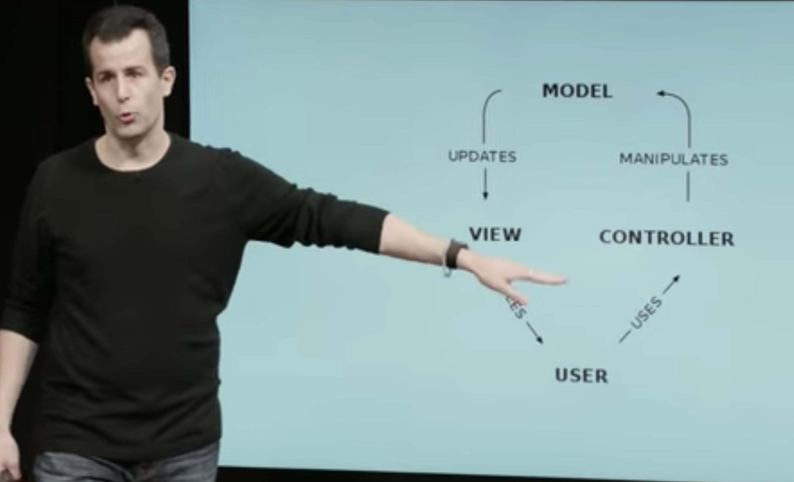

## Flask framework for web applications

This simple application asks for your name and ..that is it. The goal was to understand design of a web application using Flask. 

Any web application follows some design principles (those thigs that you ask "why (..)?" and the answer is "because"). In general, for a flask web aplication the parts are: 
  - application.py (or app.py) contains the python code controling the application
  - requirements.txt contains a list of all libraries
  - statics/ folder with all static code 
  - templates/ folder with the different routes .html
  
 The app will be served at your local host http://127.0.0.1:5000/.

  
One of the common design patters is MVC - Model View Controller - 
    - Model: contains the application data (sql database, csv ,..) 
    - View: presents the model data to the user 
    - Controller: the piece connecting view and model. 
    
   
  
  
  In this applcation, I am using "GET" and "POST", and templates like layout.html and it was written following Prof Malan lecture (CS50 Lecture9 Flask).  
